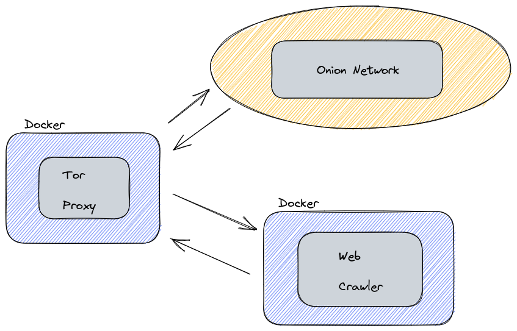

### Web Crawler

A self study project on how to implement a web crawler using a proxy

---

## Prerequistes

* Docker https://docs.docker.com/desktop/

* Docker Comopse https://docs.docker.com/compose/install/

---

## How To Run


```bash
# clone the repository

# check that your docker is running
$ sudo systemctl status docker

# on the directory of docker-compose.yml run
$ sudo docker-compose up --build
```

---

### Design


